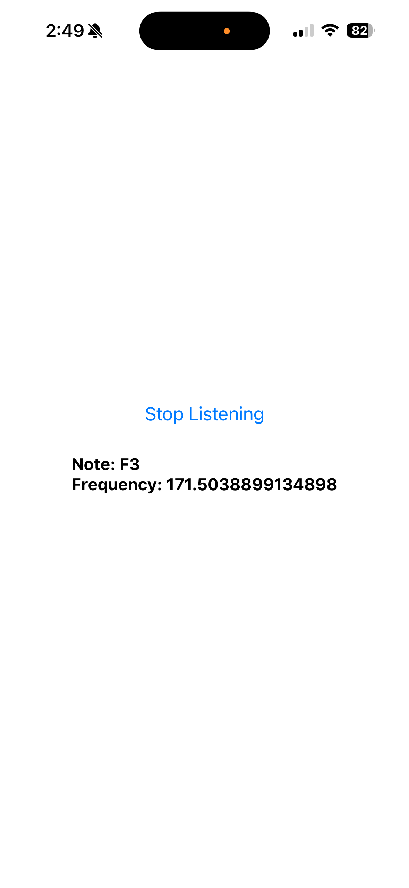

# @techoptio/react-native-live-pitch-detection

Live pitch detection (frequency, note and octave) from device microphone for React Native.

This package was heavily inspired by, but not a direct fork of, https://github.com/rnheroes/react-native-pitchy.

This package uses Turbo Modules and is only compatible with the new architecture.

## Installation

```sh
npm install @techoptio/react-native-live-pitch-detection
```

### iOS

For iOS, you'll need to add microphone permission to your `Info.plist`:

```xml
<key>NSMicrophoneUsageDescription</key>
<string>This app needs microphone access to detect pitch.</string>
```

### Android

For Android, you'll need to add microphone permission to your `AndroidManifest.xml`:

```xml
<uses-permission android:name="android.permission.RECORD_AUDIO" />
```

## Usage

> **Important:** This library assumes microphone permissions have already been requested and granted before calling `startListening()`. Make sure to request permissions using a library like [`react-native-permissions`](https://github.com/zoontek/react-native-permissions) before using this library.

```tsx
import PitchDetection from '@techoptio/react-native-live-pitch-detection';
import { request, PERMISSIONS, RESULTS } from 'react-native-permissions';
import { Platform } from 'react-native';

// Request microphone permission first
const permission = Platform.OS === 'ios'
  ? PERMISSIONS.IOS.MICROPHONE
  : PERMISSIONS.ANDROID.RECORD_AUDIO;

const result = await request(permission);

if (result === RESULTS.GRANTED) {
  // Configure options (optional) - should be called while not listening
  PitchDetection.setOptions({
    bufferSize: 4096,        // Audio buffer size (default: 4096)
    minVolume: -20.0,        // Minimum volume threshold in dB (default: -20.0)
    updateIntervalMs: 100,   // Update interval in milliseconds (default: 100)
    a4Frequency: 440,        // A4 note frequency in Hz (default: 440)
  });

  // Start listening
  await PitchDetection.startListening();

  // Add listener for pitch events
  const subscription = PitchDetection.addListener((event) => {
    console.log('Frequency:', event.frequency);
    console.log('Note:', event.note); // e.g., "C4", "A#3", etc.
  });

  // Stop listening when done
  await PitchDetection.stopListening();
  subscription.remove();
}
```

## API

### Methods

#### `setOptions(options: Options)`

Configure the pitch detection settings. This method is optional, as all parameters have defaults. However, if you want to customize the settings, **call this method while not listening** (i.e., before `startListening()` or after `stopListening()`), otherwise all parameters may not be applied until the next listening session.

**Parameters:**
- `options.bufferSize?: number` - Audio buffer size (default: 4096)
- `options.minVolume?: number` - Minimum volume threshold in dB (default: -20.0)
- `options.updateIntervalMs?: number` - Update interval in milliseconds (default: 100)
- `options.a4Frequency?: number` - A4 note frequency in Hz (default: 440)

#### `startListening(): Promise<void>`

Starts listening to the microphone for pitch detection.

> **Note:** Ensure microphone permissions have been requested and granted before calling this method.

#### `stopListening(): Promise<void>`

Stops listening to the microphone.

#### `addListener(callback: (event: PitchEvent) => void): EventSubscription`

Adds a listener for pitch detection events. Returns an `EventSubscription` that should be removed when no longer needed.

**Event:**
```typescript
type PitchEvent = {
  frequency: number;  // Detected frequency in Hz
  note: string;       // Musical note (e.g., "C4", "A#3", "-" if no note detected)
};
```

#### `isListening(): boolean`

Returns `true` if currently listening, `false` otherwise.

## Types

```typescript
type Options = {
  bufferSize?: number;
  minVolume?: number;
  updateIntervalMs?: number;
  a4Frequency?: number;
};

type PitchEvent = {
  frequency: number;
  note: string;
};
```

## Example

Check out the [example app](example/) for a complete working implementation.



## Contributing

- [Development workflow](CONTRIBUTING.md#development-workflow)
- [Sending a pull request](CONTRIBUTING.md#sending-a-pull-request)
- [Code of conduct](CODE_OF_CONDUCT.md)

## License

MIT

---

Made with [create-react-native-library](https://github.com/callstack/react-native-builder-bob)
